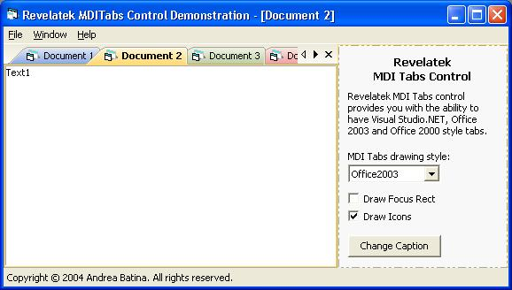



## Revelatek MDITabs Control v1\.05 \*BIG UPDATE\*

### Description

Revelatek MDI Tabs control provides you with the ability to have Visual Studio.NET, Office 2003 and Office 2000 style tabs. To use this control you don't have to write a single line of code you just need to put it on MDI form and that's all!

UPDATE: Check out comments bellow for update history.
 
### More Info
 

             |
---                |---
**Submitted On**   |2004-11-19 15:12:22
**By**             |[Andrea Batina\[Revelatek\]](https://github.com/Planet-Source-Code/PSCIndex/blob/master/ByAuthor/andrea-batina-revelatek.md)
**Level**          |Intermediate
**User Rating**    |5.0 (165 globes from 33 users)
**Compatibility**  |VB 5\.0, VB 6\.0
**Category**       |[OLE/ COM/ DCOM/ Active\-X](https://github.com/Planet-Source-Code/PSCIndex/blob/master/ByCategory/ole-com-dcom-active-x__1-29.md)
**World**          |[Visual Basic](https://github.com/Planet-Source-Code/PSCIndex/blob/master/ByWorld/visual-basic.md)
**Archive File**   |[Revelatek\_18200511192004\.zip](https://github.com/Planet-Source-Code/andrea-batina-revelatek-revelatek-mditabs-control-v1-05-big-update__1-57301/archive/master.zip)

